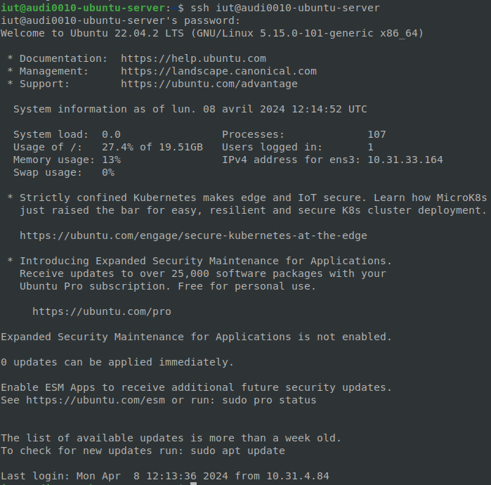
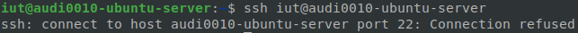
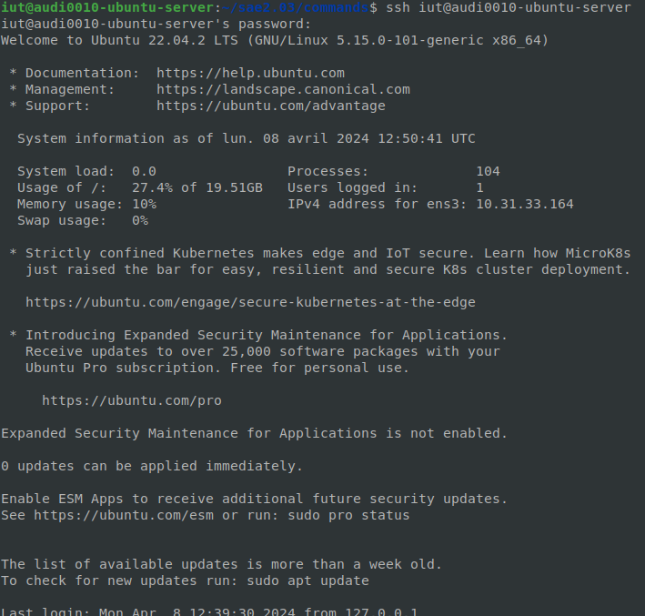

<strong><h1>
SAE 2.03
</h1></strong>
<h2>
Module Réseau
</h2>
 

<u>Objectifs :</u>
- Installer et configurer un serveur Web complet sur votre machine virtuelle Linux Ubuntu créée en TD R2.05
- Installer et configurer un serveur Web Apache
- Installer et configurer PHP
- Installer et configurer MySQL
- Installer et configurer phpMyAdmin
- Gérer des services sur un système Linux

<u>Sommaire :</u>
1. [Gestion des services : <code>systemd</code>](#1)
   1.1. 

## 1. Gestion des services : <code>systemd</code>

<u>Travail à réaliser :</u>
- Consultez le manuel de la commande <code>systemctl</code> dont la syntaxe générale est : <code>systemctl action cible [option(s)]</code>

- Affichez la liste des services démarrés avec la commande <code>systemctl</code>
   > Resultat : [fichier texte](commands/CMDP1Question1.txt)
- Si ce n'est déjà fait lors de l'installation, installez le paquet <code>sshd</code> avec la commande suivante : <code>apt-get install openssh-server</code>
   > Resultat : [fichier texte](commands/CMDP1Question1-2.txt)
- Vérifiez que le service <code>sshd</code> est démarré en faisant une connexion ssh sur votre propre machine <code>ssh <adresse_IP_de_votre_VM></code>

   > Resultat de la commande : <code>ssh iut@audi0010-ubuntu-server</code>

- Déconnectez-vous en tapant <code>exit</code> ou CTRL+D

- Stoppez le service sshd puis tentez de vous reconnecter. Que constatez-vous ?
   > Après la commande : <code>sudo systemctl stop ssh.service</code>
   
   > Il n'est pas possible de se reconnecter : 

   Car le service ssh est stopper
- Redémarrez le service <code>sshd</code>
   > Après la commande : <code>sudo systemctl start ssh.service</code>
   
   > On peut se reconnecter : 

## 2. Serveur Web Apache
### 2.1. Configuration de base