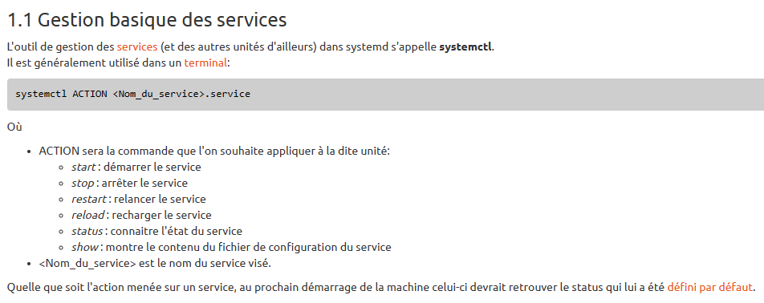

<strong><h1>
SAE 2.03
</h1></strong>
<h2>
Module Réseau
</h2>
 

<u>Objectifs :</u>
- Installer et configurer un serveur Web complet sur votre machine virtuelle Linux Ubuntu créée en TD R2.05
- Installer et configurer un serveur Web Apache
- Installer et configurer PHP
- Installer et configurer MySQL
- Installer et configurer phpMyAdmin
- Gérer des services sur un système Linux

<u>Sommaire :</u>
- [1. Gestion des services : systemd](#1-gestion-des-services--systemd)
- [2. Serveur Web Apache](#2-serveur-web-apache)
  - [2.1. Configuration de base](#21-configuration-de-base)
  - [2.2. Les serveurs virtuels](#22-les-serveurs-virtuels)
- [3. Serveur Web sécurisé https](#3-serveur-web-sécurisé-https)
- [4. Langage de programmation PHP](#4-langage-de-programmation-php)
- [5. Serveur de base de données MySQL](#5-serveur-de-base-de-données-mysql)
- [6. Outil d'administration de bases de données phpMyAdmin](#6-outil-dadministration-de-bases-de-données-phpmyadmin)

# 1. Gestion des services : <code>systemd</code>

<u>Travail à réaliser :</u>
- Consultez le manuel de la commande <code>systemctl</code> dont la syntaxe générale est : <code>systemctl action cible [option(s)]</code>

- Affichez la liste des services démarrés avec la commande <code>systemctl</code>

   Resultat : [fichier texte](commands/CMDP1Question1.txt)
- Si ce n'est déjà fait lors de l'installation, installez le paquet <code>sshd</code> avec la commande suivante : <code>apt-get install openssh-server</code>

   Resultat : [fichier texte](commands/CMDP1Question1-2.txt)
- Vérifiez que le service <code>sshd</code> est démarré en faisant une connexion ssh sur votre propre machine <code>ssh adresse_IP_de_votre_VM</code>

   Resultat de la commande : <code>ssh iut@audi0010-ubuntu-server</code>
- Déconnectez-vous en tapant <code>exit</code> ou CTRL+D
- Stoppez le service sshd puis tentez de vous reconnecter. Que constatez-vous ?
   Après la commande : <code>sudo systemctl stop ssh.service</code>
   
   Il n'est pas possible de se reconnecter, car le service ssh est stopper

- Redémarrez le service <code>sshd</code>
   Après la commande : <code>sudo systemctl start ssh.service</code>

# 2. Serveur Web Apache
## 2.1. Configuration de base

- Installez le paquet apache2

   <code>sudo apt-get install apache2</code>
- Vérifiez le bon démarrage du service apache2 à l'aide de la commande <code>systemctl</code>

   La commande <code>sudo systemctl start apache2</code> démarre le service apache2

   La commande <code>sudo systemctl status</code> montre que le service est bien démarrer

- Vérifiez le bon fonctionnement de votre serveur Web en accédant à
<code>http://adresse_IP_de_votre_VM</code> à partir d’un navigateur

- Explorez le contenu du répertoire <code>/etc/apache2</code>
   
- Lisez le fonctionnement de la configuration au début du fichier <code>apache2.conf</code> en particulier le mécanisme des liens symboliques dans les répertoires <code>xxx-enabled</code>

- Activez les pages d'accueil des utilisateurs à l'aide du module <code>userdir</code> en utilisant la commande suivante : <code>a2enmod userdir</code>

   <code>sudo a2enmod userdir</code>

- Rechargez la configuration du serveur Web en redémarrant le service <code>apache2</code> à l'aide de la commande <code>systemctl</code>

   <code>sudo systemctl restart apache2</code>

- Créez le répertoire public_html dans le répertoire d’accueil de l'utilisateur iut

   <code>mkdir public_html</code>
- Donnez les droits d’accès à l’utilisateur du serveur Web <code>www-data</code> pour lui permettre l'accès à votre répertoire d’accueil ainsi qu'au répertoire   <code>public_html</code>

   <code>sudo chown iut:www-data public_html/</code>
   <code>sudo chown iut:www-data ~/</code>

- Affectez les droits par défaut correspondant au répertoire <code>public_html</code>

   <code>sudo chmod 755 public_html/</code>

- Vérifiez le bon fonctionnement de votre serveur en accédant à la page <code>http://adresse_IP_de_votre_VM/~iut</code>

   La page fonctionne

- Le listage des répertoires amene une faiblesse de sécurité, désactivez ce mécanisme en supprimant l'option <code>Indexes</code> du fichier <code>userdir.conf</code>

- Vérifiez que le listage n'est plus possible en rechargeant la page <code>http://adresse_IP_de_votre_VM/~iut</code> (rechargez le cache si nécessaire)

- Créez un fichier <code>bienvenue.html</code> dans ce répertoire, contenant la phrase "Bienvenue sur votre site perso"

- Vérifiez le bon fonctionnement de votre serveur en accédant à la page
<code>http://adresse_IP_de_votre_VM/~iut/bienvenue.html</code>

## 2.2. Les serveurs virtuels
- Configuration d'un serveur Web virtuel

   <code>nslookup 10.31.33.164</code>

- Créez un répertoire de travail <code>mon_serveur</code> dans le répertoire d'accueil (<code>$HOME</code>) de l'utilisateur **iut** de votre machine virtuelle.
   <code>mkdir mon_serveur</code>

- Donnez les droits d'accès à ce répertoire pour l'utilisateur <code>www-data</code>
  
   <code>sudo chown iut:www-data mon_serveur/</code>

   <code>sudo chmod 755 mon_serveur/</code>

   <code>sudo apt-get install acl</code>
   
   <code>getfacl mon_serveur/</code>

   Droit execution et de lecture pour <code>www-data</code>

- Créez un lien symbolique de votre répertoire vers l'arborescence /var/www avec la commande suivante :
  
   <code>sudo ln -s /home/iut/mon_serveur /var/www</code>

- Créez un fichier <code>index.html</code> contenant une phrase simple, dans le répertoire <code>mon_serveur</code>
  

- Déplacez vous dans le répertoire <code>/etc/apache2/sites-available</code>

   <code>cd /etc/apache2/sites-available</code>

- Copiez le fichier <code>000-default.conf</code> en <code>nom_DNS_de_votre_VM.conf</code>

  <code>sudo cp 000-default.conf 2A4V3-31UVM0420.conf</code>

- Éditez ce fichier et modifiez les lignes suivantes pour configurer votre serveur :

  <code>sudo nano 2A4V3-31UVM0420.conf</code>

- Activez votre site avec la commande : <code>a2ensite 2A4V3-31UVM0420</code>

   <code>sudo a2ensite 2A4V3-31UVM0420</code>

   <code>sudo systemctl reload apache2</code>

- Vérifiez l'accès à votre serveur en accédant à l'URL : <code>http://nom_DNS_de_votre_VM.ad-urca.univ-reims.fr</code>

# 3. Serveur Web sécurisé https

- Vérifiez la présence des paquets nécessaires : <code>libssl</code>, <code>openssl</code> et <code>ssl-cert</code>

   <code>dpkg -l | grep ssl</code>

- Créez le certificat correspondant à votre site et stockez-le dans le répertoire <code>/etc/apache2/ssl</code>

   <code>mkdir /etc/apache2/ssl</code> 

   <code>/usr/sbin/make-ssl-cert /usr/share/ssl-cert/ssleay.cnf /etc/apache2/ssl/apache.pem</code>
   

- Créez le fichier de configuration du VirtualHost de votre serveur <code>ssl</code> en faisant une copie du fichier <code>default-ssl.conf</code> (du répertoire <code>/etc/apache2/sites-available</code>)

   <code>sudo cp /etc/apache2/sites-available/default-ssl.conf /etc/apache2/sites-available/mon-serveur-ssl.conf</code>

- Activez le module ssl d'apache :

   <code>sudo a2enmod ssl</code>

- Activez votre site

   <code>sudo a2ensite mon-serveur-ssl.conf</code>

- Redémarrez le service apache

   <code>sudo systemctl restart apache2</code>

- Testez l'accès aux pages avec l'URL : <code>https://nom_DNS_de_votre_VM.ad-urca.univ-reims.fr</code>

# 4. Langage de programmation PHP

- Installez les paquets <code>php</code> et <code>libapache2-mod-php</code>

   <code>sudo apt-get install php</code>

   <code>sudo apt-get install libapache2-mod-php</code>

- Éditez le fichier <code>/etc/apache2/mods-enabled/php<n°_de_version>.conf</code> (le nom exact dépendant de la version installée) et commenter les 5 dernières lignes (ces lignes interdisent l’exécution de php pour les pages Web des utilisateurs)
  
  <code>sudo nano /etc/apache2/mods-enabled/php8.1.conf</code>

- Redémarrez le service apache2

   <code>sudo systemctl restart apache2</code>

- Créez un fichier <code>index.php</code> dans votre répertoire <code>public_html</code> contenant la ligne suivante : <code><?php phpinfo();</code>

  <code>touch index.php</code>

  <code>nano index.php</code>

- Vérifiez le résultat en affichant la page correspondante dans votre navigateur.

# 5. Serveur de base de données MySQL

- Installez le paquet <code>mysql-server</code>
  <code>sudo apt-get install mysql-server</code>

- Configurez la sécurité avec la commande suivante : <code>sudo mysql_secure_installation</code>
  
- Vous allez maintenant créer un utilisateur qui aura les privilèges nécessaires à la gestion 
  des bases de données en suivant les étapes suivantes :
  
  - Se connectez en tant que <code>root</code>
   <code>sudo mysql</code>

  - Créez un utilisateur en mettant un mot de passe (simple pour l'exercice mais compliqué dans la réalité)
   <code>CREATE USER 'admin'@'localhost' IDENTIFIED BY 'simple_mot_de_passe';</code>

  - Donnez tous les privilèges à cet utilisateur
   <code>GRANT ALL PRIVILEGES ON *.* TO 'admin'@'localhost' WITH GRANT OPTION;</code>

- Quittez mysql avec la commande
   <code>exit</code>

- Redémarrez le service <code>mysql</code>
   <code>systemctl restart mysql</code>

- Testez le serveur avec la commande suivante :
   <code>mysqlshow -u admin -p</code>

# 6. Outil d'administration de bases de données phpMyAdmin

- Installez le paquet <code>phpmyadmin</code> et répondez attentivement aux différentes questions
   <code>sudo apt-get install phpmyadmin</code>

- Sélectionnez <code>apache2</code>

- Sélectionnez "oui" pour l'utilisation de <code>dbconfig-common</code>

- Sélectionnez un mot de passe simple dont vous vous souviendrez. Ce mot de passe concerne l'utilisateur <code>phpmyadmin</code> qui se connectera à votre base de données.

- Un fichier de configuration pour apache a été ajouté dans le répertoire <code>/etc/apache2/conf-enabled</code>. Cette configuration sera donc automatiquement activée au redémarrage du serveur Web.

- Activez le module de gestion des chaînes de caractères multi-octets de php
   <code>sudo phpenmod mbstring</code>

- Redémarrez le service <code>apache2</code>
   <code>sudo systemctl restart apache2</code>

- Testez l'outil en vous connectant à l'adresse <code>http://<adresse_IP_de_votre_VM>/phpmyadmin</code>.
Utilisez l'utilisateur <code>admin</code> créé à la suite de l'installation de <code>mysql</code> pour vous connecter.

- Créez un utilisateur <code>mysqltest</code> en cochant l'option "Créer une base portant son nom" et donnez à cet utilisateur tous les privilèges sur cette base

- Testez la connexion à <code>phpMyMdmin</code> avec cet utilisateur.