<strong><h1>
SAE 2.03
</h1></strong>
<h2>
Module Réseau
</h2>
 

<u>Objectifs :</u>
- Installer et configurer un serveur Web complet sur votre machine virtuelle Linux Ubuntu créée en TD R2.05
- Installer et configurer un serveur Web Apache
- Installer et configurer PHP
- Installer et configurer MySQL
- Installer et configurer phpMyAdmin
- Gérer des services sur un système Linux

<u>Sommaire :</u>
- 1. [Gestion des services : <code>systemd</code>](#1)
- 2. [Serveur Web Apache](#2) 
   - 2.1. [Configuration de base](#21)
   - 2.2. [Les serveurs virtuels](#22)

# 1. Gestion des services : <code>systemd</code>

<u>Travail à réaliser :</u>
- Consultez le manuel de la commande <code>systemctl</code> dont la syntaxe générale est : <code>systemctl action cible [option(s)]</code>

- Affichez la liste des services démarrés avec la commande <code>systemctl</code>

   Resultat : [fichier texte](commands/CMDP1Question1.txt)
- Si ce n'est déjà fait lors de l'installation, installez le paquet <code>sshd</code> avec la commande suivante : <code>apt-get install openssh-server</code>

   Resultat : [fichier texte](commands/CMDP1Question1-2.txt)
- Vérifiez que le service <code>sshd</code> est démarré en faisant une connexion ssh sur votre propre machine <code>ssh adresse_IP_de_votre_VM</code>

   Resultat de la commande : <code>ssh iut@audi0010-ubuntu-server</code>

- Déconnectez-vous en tapant <code>exit</code> ou CTRL+D
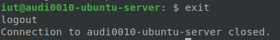

- Stoppez le service sshd puis tentez de vous reconnecter. Que constatez-vous ?
   Après la commande : <code>sudo systemctl stop ssh.service</code>
   
   Il n'est pas possible de se reconnecter : 

   Car le service ssh est stopper
- Redémarrez le service <code>sshd</code>
   Après la commande : <code>sudo systemctl start ssh.service</code>
   
   On peut se reconnecter : 

# 2. Serveur Web Apache
## 2.1. Configuration de base

- Installez le paquet apache2

   Resultat de la commande <code>sudo apt-get install apache2</code> :
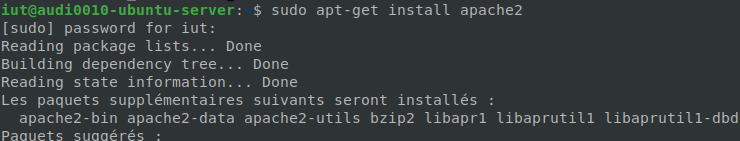

- Vérifiez le bon démarrage du service apache2 à l'aide de la commande <code>systemctl</code>

   La commande <code>sudo systemctl start apache2</code> démarre le service apache2

   La commande <code>sudo systemctl status</code> montre que le service est bien démarrer 
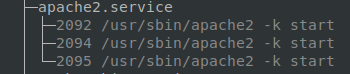

- Vérifiez le bon fonctionnement de votre serveur Web en accédant à
<code>http://adresse_IP_de_votre_VM</code> à partir d’un navigateur

   
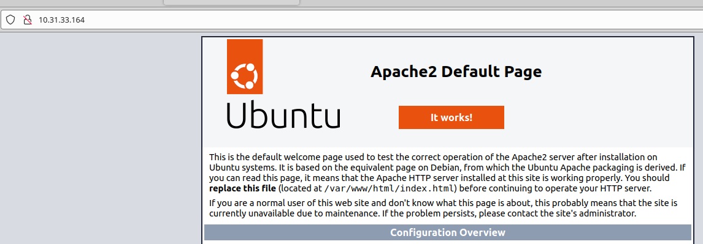

- Explorez le contenu du répertoire <code>/etc/apache2</code>
   
   
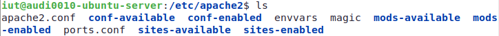

- Lisez le fonctionnement de la configuration au début du fichier <code>apache2.conf</code> en particulier le mécanisme des liens symboliques dans les répertoires <code>xxx-enabled</code>

   

- Activez les pages d'accueil des utilisateurs à l'aide du module <code>userdir</code> en utilisant la commande suivante : <code>a2enmod userdir</code>

   Resultat de la commande <code>sudo a2enmod userdir</code> : 
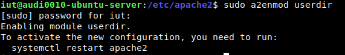

- Rechargez la configuration du serveur Web en redémarrant le service <code>apache2</code> à l'aide de la commande <code>systemctl</code>

   <code>sudo systemctl restart apache2</code>

- Créez le répertoire public_html dans le répertoire d’accueil de l'utilisateur iut

   <code>mkdir public_html</code>
- Donnez les droits d’accès à l’utilisateur du serveur Web <code>www-data</code> pour lui permettre l'accès à votre répertoire d’accueil ainsi qu'au répertoire <code>public_html</code>

   
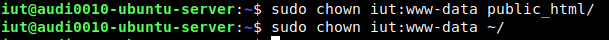

- Affectez les droits par défaut correspondant au répertoire <code>public_html</code>

   
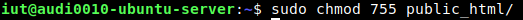

- Vérifiez le bon fonctionnement de votre serveur en accédant à la page <code>http://adresse_IP_de_votre_VM/~iut</code>

   La page fonctionne
   
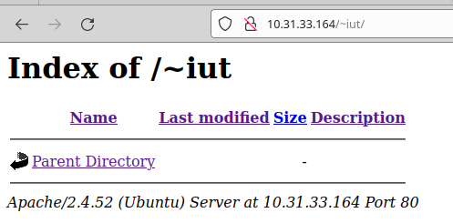

- Le listage des répertoires amene une faiblesse de sécurité, désactivez ce mécanisme en supprimant l'option <code>Indexes</code> du fichier <code>userdir.conf</code>

   
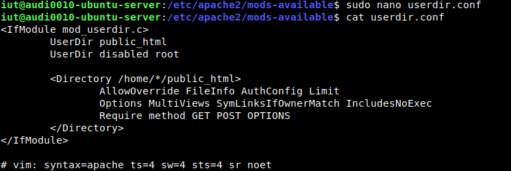

- Vérifiez que le listage n'est plus possible en rechargeant la page <code>http://adresse_IP_de_votre_VM/~iut</code> (rechargez le cache si nécessaire)

   
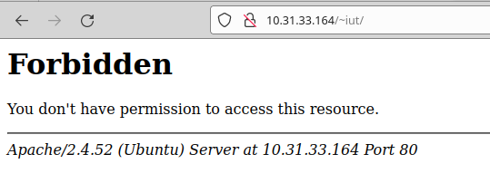
   

- Créez un fichier <code>bienvenue.html</code> dans ce répertoire, contenant la phrase "Bienvenue sur votre site perso"

   
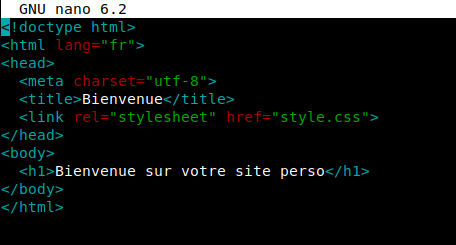
   

- Vérifiez le bon fonctionnement de votre serveur en accédant à la page
<code>http://adresse_IP_de_votre_VM/~iut/bienvenue.html</code>

   
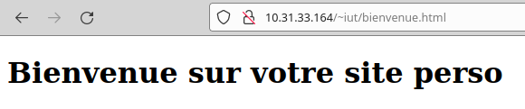

## 2.2. Les serveurs virtuels
- Configuration d'un serveur Web virtuel
   <code>nslookup 10.31.33.164</code>
   
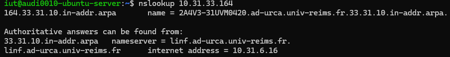

- Créez un répertoire de travail <code>mon_serveur</code> dans le répertoire d'accueil (<code>$HOME</code>) de l'utilisateur **iut** de votre machine virtuelle.
   <code>mkdir mon_serveur</code>

- Donnez les droits d'accès à ce répertoire pour l'utilisateur <code>www-data</code>
  
   <code>sudo chown iut:www-data mon_serveur/</code>
   <code>sudo chmod 755 mon_serveur/</code>
   <code>sudo apt-get install acl</code>
   
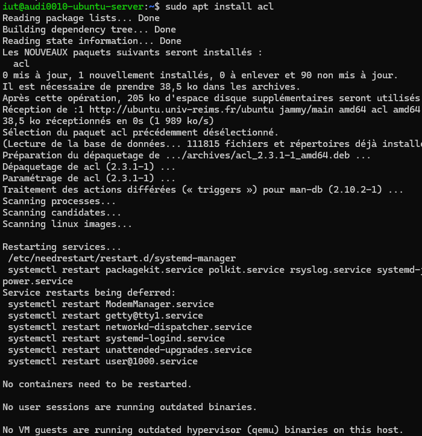

   <code>getfacl mon_serveur/</code>
   
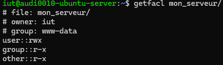

   Droit execution et de lecture pour <code>www-data</code>

- Créez un lien symbolique de votre répertoire vers l'arborescence /var/www avec la commande suivante :
  
   <code>sudo ln -s /home/iut/mon_serveur /var/www</code>

- Créez un fichier <code>index.html</code> contenant une phrase simple, dans le répertoire <code>mon_serveur</code>
  
  
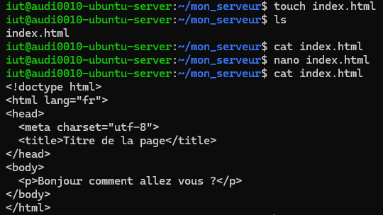

- Déplacez vous dans le répertoire <code>/etc/apache2/sites-available</code>
   <code>cd /etc/apache2/sites-available</code>

- Copiez le fichier <code>000-default.conf</code> en <code>nom_DNS_de_votre_VM.conf</code>
  <code>sudo cp 000-default.conf 2A4V3-31UVM0420.conf</code>

- Éditez ce fichier et modifiez les lignes suivantes pour configurer votre serveur :
  <code>sudo nano 2A4V3-31UVM0420.conf</code>
  

- Activez votre site avec la commande : <code>a2ensite 2A4V3-31UVM0420</code>
   <code>sudo a2ensite 2A4V3-31UVM0420</code>
   <code>sudo systemctl reload apache2</code>